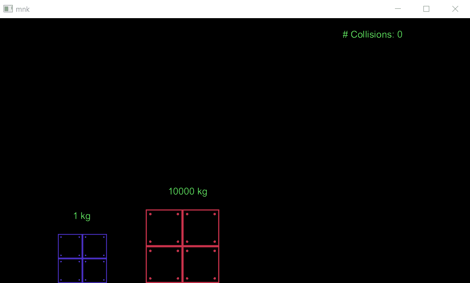

# mnk Game Engine
mnk is simple 2D game engine written in C++. It can render sprites, fonts and work with audio.

# Media
Gifs have low frame rate due to gif recorder. (VSync on)

(Source: https://www.youtube.com/watch?v=HEfHFsfGXjs)
